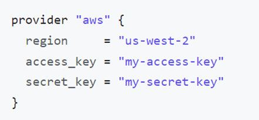
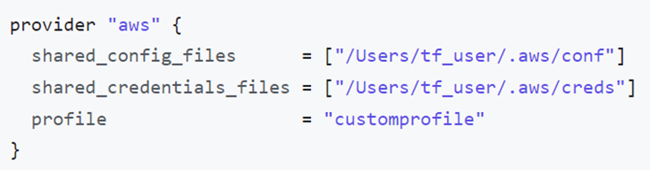
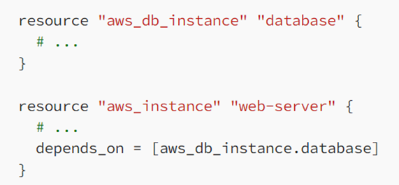
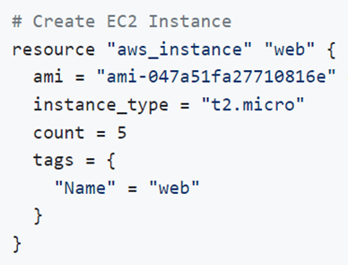
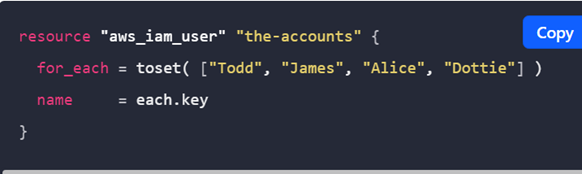
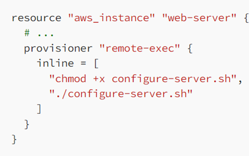
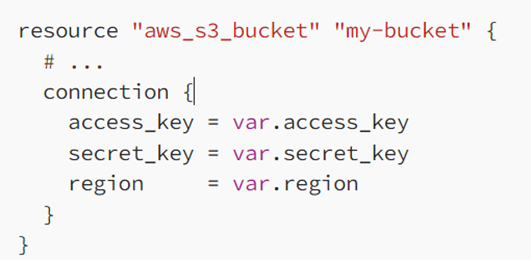
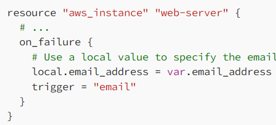

# Blocks
------------------------------------------
## Fundamental block
- Terraform block
- Provider block
- Resources block

## Variable block
- Input variable block
- Output variable block
- Local value block

## Referencing block
- Data source block
- Modules block

-------------------------------------------

# Provisioners
- File
- remote-exec
- local-exec

-------------------------------------------
# Workflow
- Terraform init: initializes a working directory containing Terraform configuration files.
- Terraform validate: validates the configuration files in a directory, referring only to the configuration and not accessing any remote services
- Terraform plan: will display the steps that will be taken by terraform on resources
- Terraform apply: perform the steps on resources
- Terraform destroy: will destroy the resources managed by terraform

## Terraform resources
They have arguments, attributes and meta-arguments
- Arguments: Used to configure a specific resource, `<Identifier>=<Expression>`
- Attributes: Data that belongs to an object, `<aws_instance.example.id>`
- meta-arguments: Used to customize behaviour of modules and resources, not resource specific `count, depends_on, provider, lifecycle, provisioner, data etc. `
-----------------------------------------------

-----------------------------------------------
- Terraform automatically creates or updates the dependency lock file each time you run the terraform init command. 
- The lock file is named as `.terraform.lock.hcl`
- This file contains information like version, constraints, hashes, provider

-----------------------------------------------
## Provider Authentication
- As parameter 
    
- As environment variable
    
- As config files located at `$~/.aws/config`
    

--------------------------------------------
## Resource behavior
When Terraform creates a new infrastructure object represented by a resource block, the identifier for that real object is saved in Terraform's state, allowing it to be updated and destroyed in response to future changes.

Applying Terraform configuration will:
- Create resources that exist in the configuration but are not associated with a real infrastructure object in the state.
- Destroy resources that exist in the state but no longer exist in the configuration
- Update in-place resources whose arguments have changed
- Destroy and re-create resources whose arguments have changed but which cannot be updated in-place due to remote API limitations.

`Accessing resource attributes: <RESOURCE TYPE>.<NAME>.<ATTRIBUTE>`

## Meta-Arguments
They are used to change resource behaviour
- depends_on: This argument allows you to specify dependencies between resources , example- you want webserver to be created after database
    
- count: This argument allows to create multiple instances of a module or a resource
    
- for_each: This argument allows you to create multiple instances of a resource or module using a list or map of values. This can be useful for creating resources based on dynamic input data.
    
    	each.key — The map key (or set member) corresponding to this instance
    	each.value — The map value corresponding to this instance. (If a set was provided, this is the same as each.key
- provisioner: This argument allows you to run custom scripts or programs on a resource after it has been created. This is useful for tasks such as installing software on a virtual machine or configuring a database
    
- Output: This argument allows you to define custom output values for a module or resource. These output values can be accessed from other modules or resources, or displayed to the user when running the terraform apply command.
    
- Connection: This argument allows you to specify connection details for a resource that requires access to other resources or external services.
    
- on_failure: This argument allows you to specify a custom behavior for when a resource fails to be created or destroyed. This can be useful for handling errors or cleaning up after failed operations.
    

------------------------------------------------
## Lifecycle 
used to manage the lifecycle of a resource. It provides a way to specify additional behavior that affects how Terraform handles changes to a resource.
o	create_before_destroy: This boolean value determines whether Terraform creates a new resource before destroying the old one. If set to true, Terraform will create a new resource before destroying the old one. This is useful for resources that can’t be updated in place, such as databases.
o	prevent_destroy: This boolean value determines whether Terraform can destroy a resource. If set to true, Terraform will prevent the resource from being destroyed. This is useful for resources that should never be deleted, such as production databases or key management systems.
o	ignore_changes: This list of attributes determines which resource attributes Terraform should ignore when determining whether a change has occurred. If an attribute is listed here, Terraform will ignore changes to that attribute and not try to update it.
o	replace_triggered_by: 
-----------------------------------------------