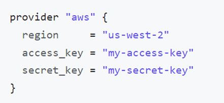

# Blocks
------------------------------------------
## Fundamental block
- Terraform block
- Provider block
- Resources block

## Variable block
- Input variable block
- Output variable block
- Local value block

## Referencing block
- Data source block
- Modules block

-------------------------------------------

# Provisioners
- File
- remote-exec
- local-exec

-------------------------------------------
# Workflow
- Terraform init: initializes a working directory containing Terraform configuration files.
- Terraform validate: validates the configuration files in a directory, referring only to the configuration and not accessing any remote services
- Terraform plan: will display the steps that will be taken by terraform on resources
- Terraform apply: perform the steps on resources
- Terraform destroy: will destroy the resources managed by terraform

## Terraform resources
They have arguments, attributes and meta-arguments
- Arguments: Used to configure a specific resource, `<Identifier>=<Expression>`
- Attributes: Data that belongs to an object, `<aws_instance.example.id>`
- meta-arguments: Used to customize behaviour of modules and resources, not resource specific `count, depends_on, provider, lifecycle, provisioner, data etc. `
-----------------------------------------------

-----------------------------------------------
- Terraform automatically creates or updates the dependency lock file each time you run the terraform init command. 
- The lock file is named as `.terraform.lock.hcl`
- This file contains information like version, constraints, hashes, provider

-----------------------------------------------
## Provider Authentication
- As parameter 
    
- As environment variable
    
- As config files located at `$~/.aws/config`
    

--------------------------------------------