# Blocks
------------------------------------------
## Fundamental block
- Terraform block
- Provider block
- Resources block

## Variable block
- Input variable block
- Output variable block
- Local value block

## Referencing block
- Data source block
- Modules block

-------------------------------------------

# Provisioners
- File
- remote-exec
- local-exec

-------------------------------------------
# Workflow
- Terraform init: initializes a working directory containing Terraform configuration files.
- Terraform validate: validates the configuration files in a directory, referring only to the configuration and not accessing any remote services
- Terraform plan: will display the steps that will be taken by terraform on resources
- Terraform apply: perform the steps on resources
- Terraform destroy: will destroy the resources managed by terraform

## Terraform resources
They have arguments, attributes and meta-arguments
- Arguments: Used to configure a specific resource, `<Identifier>=<Expression>`
- Attributes: Data that belongs to an object, `<aws_instance.example.id>`
- meta-arguments: Used to customize behaviour of modules and resources, not resource specific `count, depends_on, provider, lifecycle, provisioner, data etc. `
-----------------------------------------------


-----------------------------------------------
- Terraform automatically creates or updates the dependency lock file each time you run the terraform init command. 
- The lock file is named as `.terraform.lock.hcl`
- This file contains information like version, constraints, hashes, provider

-----------------------------------------------
## Provider Authentication
- As parameter 
    
- As environment variable
    
- As config files located at `$~/.aws/config`
    

--------------------------------------------
## Resource behavior
When Terraform creates a new infrastructure object represented by a resource block, the identifier for that real object is saved in Terraform's state, allowing it to be updated and destroyed in response to future changes.

Applying Terraform configuration will:
- Create resources that exist in the configuration but are not associated with a real infrastructure object in the state.
- Destroy resources that exist in the state but no longer exist in the configuration
- Update in-place resources whose arguments have changed
- Destroy and re-create resources whose arguments have changed but which cannot be updated in-place due to remote API limitations.

`Accessing resource attributes: <RESOURCE TYPE>.<NAME>.<ATTRIBUTE>`

## Meta-Arguments
They are used to change resource behaviour
- depends_on: This argument allows you to specify dependencies between resources , example- you want webserver to be created after database
    
- count: This argument allows to create multiple instances of a module or a resource
    
- for_each: This argument allows you to create multiple instances of a resource or module using a list or map of values. This can be useful for creating resources based on dynamic input data.
    
    	each.key — The map key (or set member) corresponding to this instance
    	each.value — The map value corresponding to this instance. (If a set was provided, this is the same as each.key
- provisioner: This argument allows you to run custom scripts or programs on a resource after it has been created. This is useful for tasks such as installing software on a virtual machine or configuring a database
    
- Output: This argument allows you to define custom output values for a module or resource. These output values can be accessed from other modules or resources, or displayed to the user when running the terraform apply command.
    
- Connection: This argument allows you to specify connection details for a resource that requires access to other resources or external services.
    
- on_failure: This argument allows you to specify a custom behavior for when a resource fails to be created or destroyed. This can be useful for handling errors or cleaning up after failed operations.
    

------------------------------------------------
## Lifecycle 
used to manage the lifecycle of a resource. It provides a way to specify additional behavior that affects how Terraform handles changes to a resource.
- create_before_destroy: This boolean value determines whether Terraform creates a new resource before destroying the old one. If set to true, Terraform will create a new resource before destroying the old one. This is useful for resources that can’t be updated in place, such as databases.
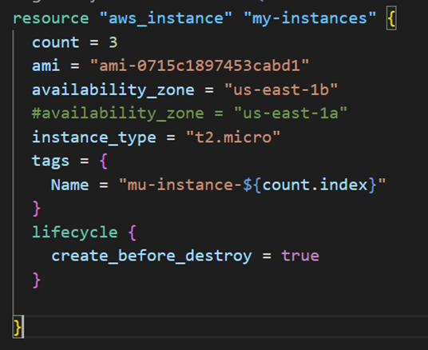

- prevent_destroy: This boolean value determines whether Terraform can destroy a resource. If set to true, Terraform will prevent the resource from being destroyed. This is useful for resources that should never be deleted, such as production databases or key management systems.
to delete, we have to remove this resource declaration section from config file and then when we apply , resource will be deleted
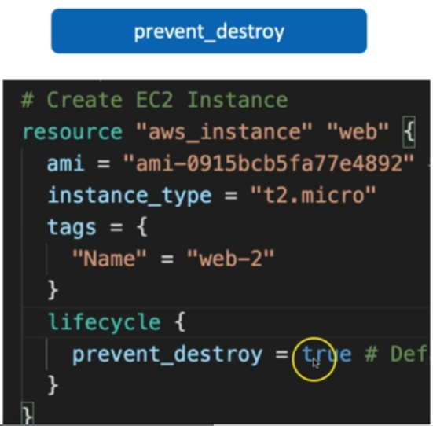

- ignore_changes: This list of attributes determines which resource attributes Terraform should ignore when determining whether a change has occurred. If an attribute is listed here, Terraform will ignore changes to that attribute and not try to update it.
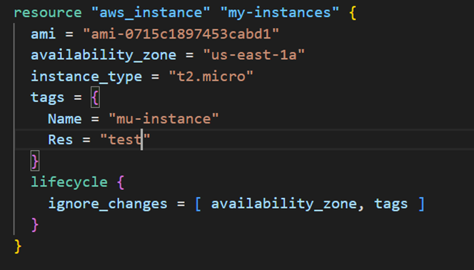

- replace_triggered_by: 
-----------------------------------------------
- State file: It is a mapping between configuration file and resource on cloud
- State file is a JSON file consisting of provider version, CLI version, Output, Resources detail
- `terraform.tfstate.backup`- Another file created with terraform apply command
- This file is like a version of the tfstate file. Whenever we modify something on our code and apply it, our tfstate file will change our resources’ information. At that point this backup file acts as an old version of the state file. So the modified resources details are in the tfstate file, and the old tfstate file will be transferred to tfstate.backup file

- Desired State: Local Terraform Manifest (All *.tf files)
- Current State: Real Resources present in your cloud

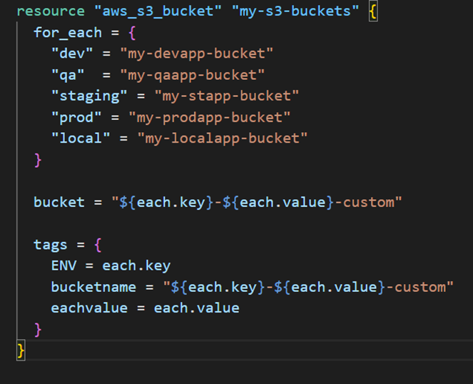

-----------------------------------------------
## Input Variables
- When you declare variables in the root module of your configuration, you can set their values using CLI options and environment variables
- When you declare them in child modules, the calling module should pass values in the module block

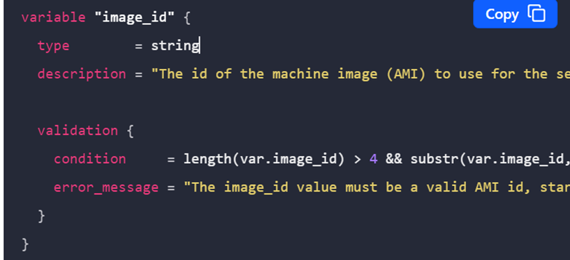

- Use precondition and postcondition blocks to create custom rules for resources, data sources, and outputs
```
    terraform plan -var-file="secrets.tfvars"
    terraform apply -var-file="secrets.tfvars"

```

- Using input variable: `var.<NAME>`

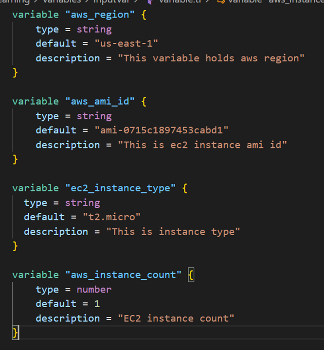

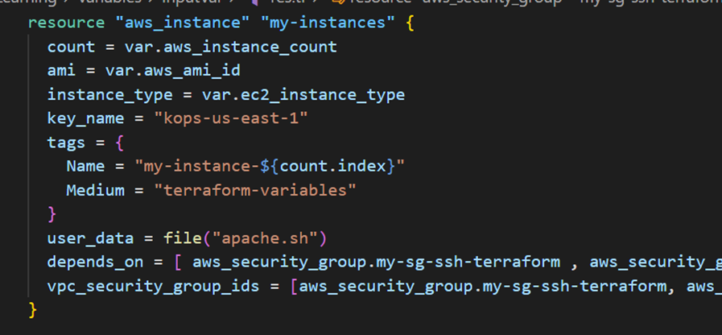

- Provide variable value at prompt - @plan, @apply, @destroy: leave the default field empty
- Override deafult value through CLI- `terraform plan/apply -var="varName=varValue"`
- Using environment variables- `export TF_VAR_varName=varValue`
- Using tfvars files

--------------------------------------------------
## Output Variables
-	Value= resource_type.local_name.attribute
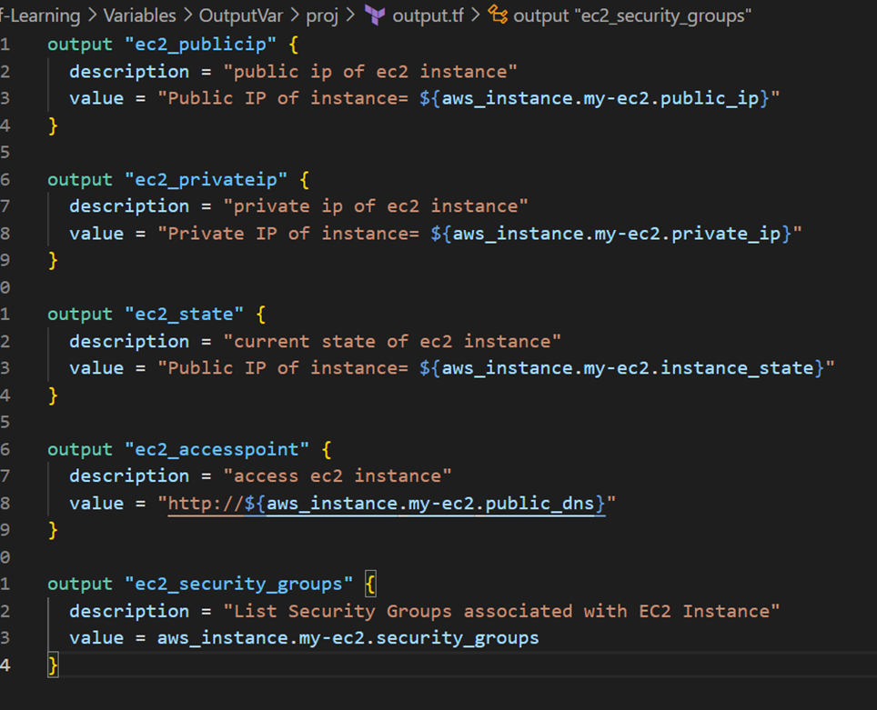

- These output values are stored in state file which can be queried using terraform output command

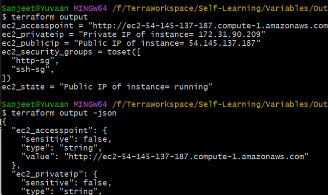

-------------------------------------------------
## Data Source
Data sources allow Terraform to use information defined outside of Terraform, defined by another separate Terraform configuration, or modified by functions.

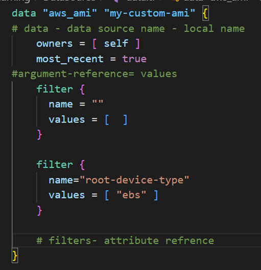

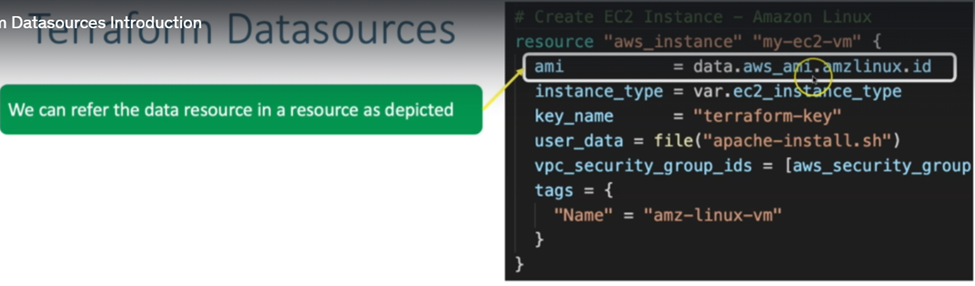

## State locking

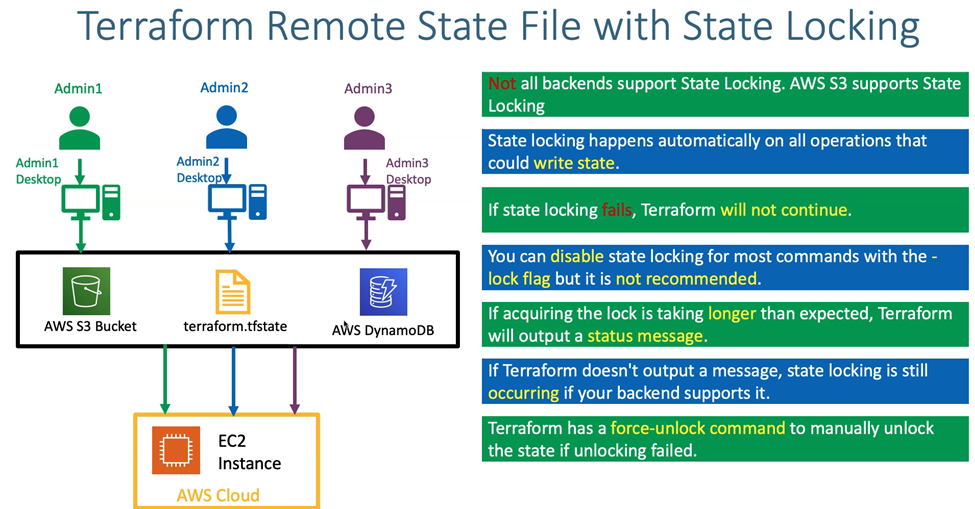

Local state file: unless the state file is shared, team cannot work on the infra, to make that possible we opt for remote state storage

Remote state file: this makes team work on the same state file, however it may give conflict issue. to solve that problem we opt for state locking

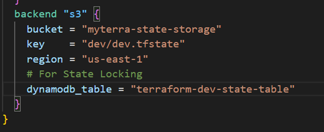

## State commands
-------------------------------------
- Terraform show- used to inspect a plan to ensure that the planned operations are expected, or to inspect the current state as Terraform plan output files are binary files. We can read them using terraform show command

- Terraform refresh- -	Changes made to infra manually on cloud console and not via terraform so state version is not updated in backend. Refresh will show you the changes by comparing the existing state file with current real infra state
    + Choice_1: If you dont want those changes proceed with terraform apply so manual changes we have done on our cloud EC2 Instance will be removed.
    + Choice_2: If you want those changes, refer terraform.tfstate file about changes and embed them in your terraform manifests (example: c4-ec2-instance.tf) and proceed with flow (referesh, plan, review execution plan and apply)

Disater recovery
-----------------------
- The terraform state pull command and the terraform state push command can directly read and write entire state files from and to the configured backend. You might need this for obtaining or restoring a state backup.

State pull:
- The terraform state pull command is used to manually download and output the state from remote state.
- This command also works with local state.

State push:
- The terraform state push command is used to manually upload a local state file to remote state.


